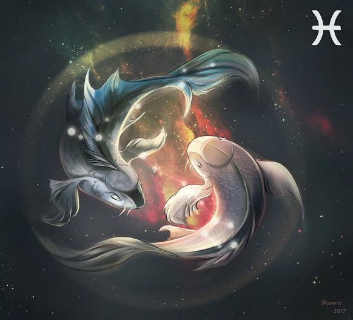
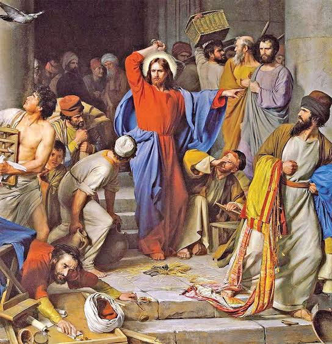

<html>
    <html lang="pt-br">
  <head>
    <meta charset="UTF-8">
    <meta name="viewport" content="width=device-width, initial-scale=1, maximum-scale=1.0">
    <title></title>
    
  </head>
       <body>
      
      <h1>Saturno Em Peixes</h1>
      <i>A Queda Dos Falsos Mestres</i>
      
        
      

      
<mark>Acautelai-vos, porém, dos falsos profetas, que vêm até vós vestidos como ovelhas, mas interiormente são lobos devoradores. Por seus frutos os conhecereis - Mateus 7:15</mark>

      

      <h1>A Teologia Da Prosperidade</h1>

      
O surgimento de denominações religiosas vem aumentando, e cada vez mais o número de placas de igreja vai surgindo, e isso está se tornando cada vez mais comum, principalmente na internet em plataformas como YouTube, e não falo só se uma religião e sim de várias.

        
Surge um "Apóstolo" "Bispo" em cima de um palco apresentando seu Show,  pregando a teologia da prosperidade e carregando um público alto com puro sentimentalismo e os que não tem o mínimo de consciência e são ingênuos de mais acabam caindo nesse teatro todo.

       
<u>Em 7 de março de  2023, às 10h35, o planeta Saturno entrou no signo de Peixes, no qual fica até o dia 14 de fevereiro de 2026, </u>entre retrogradações e movimentos direto e é focado nesse movimento que vou falar mais sobre esse assunto. 

          
        
        <h1>O Signo Da Espiritualidade</h1>
        
         
        

 
       
Peixes por ser um dos signos mais sensíveis acaba se tornando o mais espíritual de todos e como ele tem essa conexão entre o mundo material e espiritual, o nativo de peixes consegue manifestar essa energia de modo a ajudar pessoas, ser solidário, são excelentes curadores, possuem alta compaixão com o próximo altos traços da personalidade de Jesus Cristo. E como é citado no versículo da Bíblia a fé no mundo espíritual (invisível) é esperada e muito sentida por todos.
 

          
<mark>Ora, a fé é a certeza daquilo que esperamos e a prova das coisas que não vemos.  Hebreus 11:1.</mark>

         
          
         
         <h1>Saturno E A Seriedade</h1>
         
         

         
Saturno está associado ao <u>senso de responsabilidade, aos limites que são impostos pela vida e ao reconhecimento da realidade,</u> em um mundo de ilusões e falsas esperanças esse movimento de saturno em peixes vai fazer as pessoas acordarem para a realidade que vivem em suas religiões, o caráter de seus líderes vai ser provado e se não forem verdadeiros eles caem e a farsa é exposta ao público. Durante esses 3 anos escândalos  religiosos  viram a tona,  e um <mark>despertar de consciência religiosa</mark> vai acontecer no mundo, será comum as pessoas se auto questionarem   " será que estou seguindo algo verdadeiro? " estou sendo manipulado dentro desse meio ?  " estou sendo enganado por anos ? "  " as pessoas do meu meio praticam oque a religião fala ? " . 

         
           
Para fechar o assunto, um ótimo trecho da Bíblia que retrata bem oque viveremos neste periodo em questões religiosas globais:

           
           
<mark>E Jesus repreendeu-os: “Está escrito: ‘A minha casa será chamada casa de oração’; vós, ao contrário, estais fazendo dela um ‘covil de salteadores’” - Mateus 21:13.</mark>

          
         
           
         

         <a href="https://vitordev01.netlify.app/">
© Copyright Vitor Oliveira | Github pages 2023 todos os direitos reservados
</a>
      </body>
</html>
